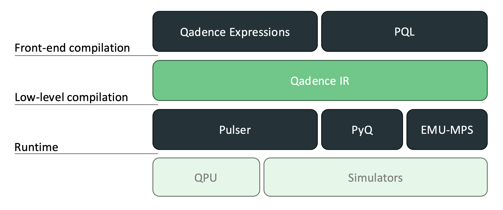

# Compute Stack

Pasqal’s compute stack comprises four layers, as shown in Figure 1. A user defines the quantum computation using one of the front-ends: Qadence 2 Expressions or PQL. The computation to be executed is processed from layer to layer and eventually executed on the hardware. In each layer, a quantum computation is expressed in a specific data structure. The higher up the layer is in the stack, the more hardware details are abstracted away.

The top layer is user-facing, with the highest level of abstraction. For each front-end, a compiler exists that compiles the computation in Qadence 2 IR. See the section IR structure for more details on its definition. The low-level compilation process targets a backend, either a QPU or a simulator, and compiles the computation into code that can run on the targeted backend. The backend itself takes care of executing the computation on the hardware.

It's important to note that the Qadence 2 IR layer spreads over the full width of the stack, meaning that all front-ends can compile to it and any backend can be targeted from it. The two-step compilation approach reduces the coupling between elements in the stack significantly and makes the codebase, therefore, more maintainable.

Figure 1: The Qadence 2 software stack.
