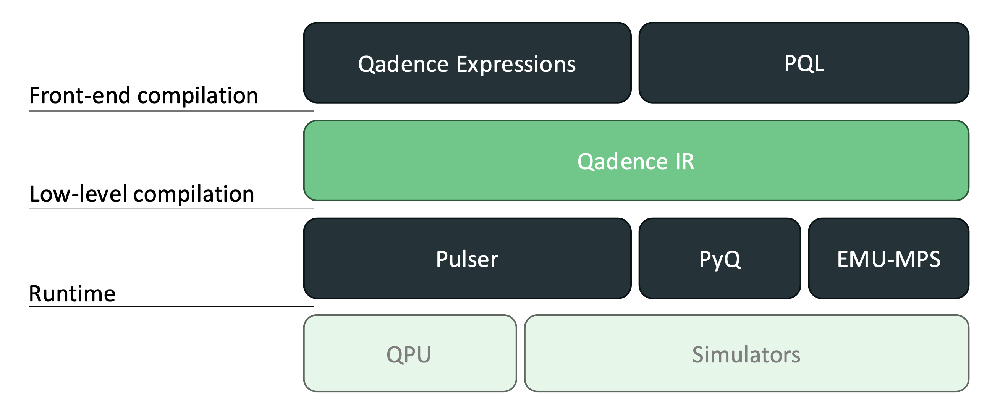

!!! warning
	This page is under construction.

# Qadence2 IR

# About
Qadence IR is a Pasqal initiative, to define an intermediate representation structure for neutral atom devices. The structure captures the key elements of the platform while remaining agnostic regarding hardware specifications. The goal is to simplify the instruction building of analog quantum algorithms, enabling optimized instructions and compilation processes of task-specific algorithms to different platforms. By using an agnostic instruction set, Qadence IR allows digital and analog instructions to work together, extending its usability to the digital-analog paradigm. The static single-assignment simplifies differentiability when running simulations.

## Compute Stack
Pasqal’s compute stack comprises four layers, as shown in Figure 1. A user defines the quantum computation using one of the frontends: Qadence Expressions or PQL. The computation to be executed is processed from layer to layer and eventually executed on the hardware. In each layer, a quantum computation is expressed in a specific data structure. The higher up the layer is in the stack, the more hardware details are abstracted away.

The top layer is user-facing, with the highest level of abstraction. For each front-end, a compiler exists that compiles the computation in Qadence IR. See the section IR structure for more details on its definition. The low-level compilation process targets a backend, either a QPU or a simulator, and compiles the computation into code that can run on the specific backend. The backend itself takes care of executing the computation on the hardware.

It's important to note that the Qadence IR layer spreads over the full width of the stack, meaning that all frontends can compile to it and any backend can be targeted from it. The two-step compilation approach reduces the coupling between elements in the stack significantly and makes the codebase, therefore, more maintainable.



## IR Structure
The idea for the Qadence IR is to provide an abstract neutral atom device model.

Neutral atom devices usually rely on absolute values like laser power, atomic spacing in micrometres, and nanosecond pulse duration. Since the interaction between atoms and, therefore, the execution of algorithms in such devices are heavily influenced by those parameters, having a well-tuned algorithm for a specific device is desired. With that in mind, the IR definition should be independent of device-specific parameters, leaving their implementation to the backend. At the same time, the front-end compilation pipeline must build the IR from the algorithm and bridges with the backend at the low-level compilation pipeline, accessing its runtime resources.

Analog-relevant data such as the qubit register, parametric symbols and quantum instructions are wrapped in the IR, enabling each backend to handle them case-by-case. In particular, the instructions will provide only minimal information, such as the qubit support and the instruction label, i.e., which quantum operator or instruction is being applied, and the backend must provide some implementation for it.

The IR Model is split in four sections:
- Inputs
- Instructions
- Register
- Directives

The *Inputs* section is responsible for declaring the classical data and flagging them as trainable or not. This information is desired to ensure that only the parameters used in the machine learning training steps are considered for differentiability.

The *Instruction* section holds the sequence of classical computation via static single-assignment to avoid duplicate computation and help the differentiability instructions.

Quantum operations are passed labels instead of fixed primitives (see Challenges section). The IR definition is independent of device-specific parameters and leaves their configuration to the compiler, which builds an IR algorithm into instructions that contain the device-specific parameters.

The *Register* section holds either an abstract description of how the atoms are placed on the register or a connectivity graph, depending on the type of algorithm. Algorithms that don’t require customized registers are allowed to pass only the number of qubits. This process is delegated to the backend compiler to decide the best strategies to organize the atoms whenever possible.

The *Directives* section holds other device critical information for resource allocation like SLM mask target for individual qubit addressability.

Resource allocation, such as Registers and Directives, is usually not expected in an intermediate representation. However, as described before, those elements can affect algorithm design and pulse execution. The Challenges section presents more details about them.

## Example
Below is an example of a simple analog algorithm represented in Qadence IR.

```python
Model(
    register=AllocQubits(
        num_qubits=3,
        connectivity={(0,1): 1., (0,2): .5, (1,2): .5},
    ),
    directives={
        "dmm": {"targets": [0, 1]}
    },
    inputs={
        't': Alloc(1, trainable=True)
    },
    instructions=[
        # The presence of the `dmm` allows a single qubit operation by
        # dynamic decoupling the others two qubits.
        QuInstruct('x', Support(target=(2,))),

        Assign('%0', Mul(1.57, Load('t')),
        QuInstruct('dyn_pulse', target_all(), Load('%0'), 1.0),
    ],
)
```

More examples can be found [here](https://github.com/pasqal-io/qadence2-ir/blob/km/docs/docs/examples.md).


## Challenges
As pointed out above, digital and analog algorithms diverge in how they handle register topology. Contrary to classical computing, where the resource allocation can be left to the OS to control, the quantum resources must be explicit in analog quantum computation.

For digital devices and circuit-based algorithms, the register topology is important mostly during the compilation phase to reduce the number of SWAP gates applied. Analog algorithms and devices, on the other hand, rely on the topology to ensure the proper interaction between qubits regarding connectivity and strength. That led us to consider including the abstract representation of the register (either by unitless coordinates or connectivity graph) as part of the IR.

However, register preparation doesn’t represent an instruction in the sense of runtime since it needs to be loaded before the sequence starts and (for analog algorithms) cannot be changed during execution. Even if shuttling is available, the initial register configuration needs to be known to properly evaluate the atoms’ movement since such action will affect the connectivity of the register.

Besides the register, other elements like the SLM used to target individual qubits are part of the “booting”/resources allocation that is not directly connected to the register but cannot be addressed as regular instructions. Still, its presence may affect the behavior of specific pulses, which motivated the inclusion of a “Directives” section on the IR.

Primitive operations are another challenge in neutral atoms. The analog nature of the algorithms and device makes it difficult to clearly define “primitive operations”. Elementary structures like a pulse corresponding to the neutral atom Hamiltonian and an idle/wait instruction to let the qubits interact under free coupling (without drive).

To avoid define a fixed set of operations that may not reflect the hardware capabilities and to avoid constant changes in the IR definition to include new primitives, the instructions’ names are passed as labels like `QuInstrunct("dyn_pulse",…)` and `QuInstruct("rx".…)` instead of `Pulse(…)` and `RX(…)`. This may change in the future. However, right now, this flexibility allows us to explore the hardware's capabilities without being held by a particular set of instructions.
